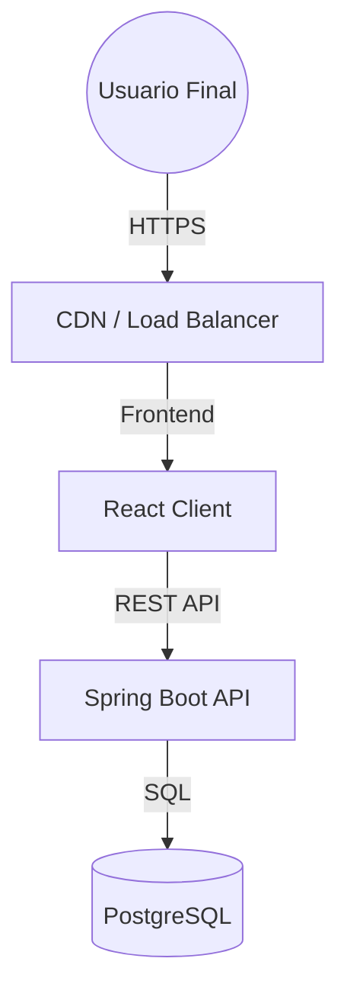

# 📚 Documentación - Peluquería SaaS

Bienvenido a la documentación oficial del proyecto **Peluquería SaaS**. Este repositorio contiene toda la información necesaria para entender, utilizar, desarrollar y desplegar la plataforma.

## 🗂 Índice de Contenidos

### 1. [Visión General](./01-vision-general.md)

- Propuesta de valor y objetivos del proyecto.
- Resumen de funcionalidades clave.
- Tecnologías utilizadas.

### 2. [Guía de Usuario](./02-guia-usuario.md)

- Manual para administradores de salones.
- Manual para empleados.
- Portal del cliente final.

### 3. [Arquitectura Técnica](./03-arquitectura-tecnica.md)

- Diseño del sistema (C4 Model).
- Patrones de arquitectura (Layered Monolith).
- Decisiones técnicas clave (ADRs).

### 4. [Backend (API & Lógica server-side)](./04-backend.md)

- Estructura del código (Java/Spring Boot).
- Endpoints y Contratos de API.
- Seguridad y Autenticación.

### 5. [Frontend (Cliente Web)](./05-frontend.md)

- Estructura del código (React/TypeScript).
- Componentes principales y Sistema de Diseño.
- Gestión de estado y rutas.

### 6. [Base de Datos](./06-base-de-datos.md)

- Esquema de base de datos (ER Diagram).
- Modelado de datos y relaciones.

### 7. [Infraestructura & DevOps](./07-infraestructura.md)

- Contenerización con Docker.
- Despliegue en producción (Render/Vercel).
- **Render Blueprints** e Infraestructura como Código (IaC).
- Pipelines y CI/CD.

### 8. [Guía de Contribución](./08-guia-contribucion.md)

- Configuración del entorno de desarrollo local.
- Estándares de código y buenas prácticas.
- Ejecución de pruebas.

---

## 🏗 Arquitectura de Alto Nivel

> **Nota:** Esta documentación se actualiza continuamente con el desarrollo del proyecto.
