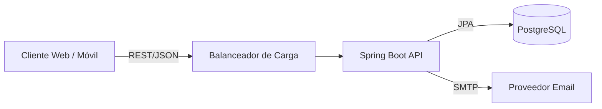

# 🏗 Arquitectura Técnica

## Diseño del Sistema

El sistema sigue una arquitectura de **Monolito Modular** en el backend y una **Single Page Application (SPA)** en el frontend. Aunque es un monolito en despliegue, está diseñado con separación de contextos (Services/Controllers) que facilitarían una eventual migración a microservicios si fuera necesario.

### Diagrama de Contexto (Nivel 1)

### Diagrama de Contenedores (Nivel 2)

| Contenedor | Tecnología | Responsabilidad |
| :--- | :--- | :--- |
| **Web App** | React 18 + Vite | Interfaz de usuario, gestión de estado y navegación. |
| **API Server** | Java 17 + Spring Boot 3 | Lógica de negocio, seguridad, validación y orquestación de datos. |
| **Database** | PostgreSQL 15 | Persistencia relacional de datos. |

---

## 🧩 Patrones de Diseño

### Backend (Layered Architecture)

El código se organiza en capas horizontales para separar responsabilidades:

1. **Controller Layer (`com.peluqueria.controller`)**:
    - Maneja las peticiones HTTP.
    - Valida entradas (DTOs).
    - Delega a servicios.
    - Retorna respuestas estandarizadas.

2. **Service Layer (`com.peluqueria.service`)**:
    - Contiene la lógica de negocio pura.
    - Transaccionalidad (`@Transactional`).
    - Manejo de reglas de negocio (e.g. "No se puede cancelar una cita 1 hora antes").

3. **Persistence Layer (`com.peluqueria.repository`)**:
    - Interfaces `JpaRepository`.
    - Abstracción del acceso a datos.

### Frontend (Feature-based Architecture)

En lugar de agrupar por tipo (todos los componentes juntos, todos los hooks juntos), se agrupa por funcionalidad (`features/auth`, `features/citas`), lo que mejora la escalabilidad.

---

## 🔐 Seguridad y Autenticación

- **Protocolo**: OAuth2 resource server implementado via JWT customizado.
- **Flujo**:
    1. Cliente envía credenciales (`POST /auth/login`).
    2. Servidor valida y retorna `access_token` (JWT).
    3. Cliente almacena token (localStorage/HttpOnly Cookie).
    4. Cliente envía header `Authorization: Bearer <token>` en cada petición.
- **Roles**:
  - `ROLE_ADMIN`: Acceso total a la configuración de su `Enterprise`.
  - `ROLE_EMPLOYEE`: Acceso a agenda y citas.
  - `ROLE_CLIENT`: Acceso solo a su propio perfil y reservas.

---

## 🏢 Estrategia Multi-tenant

El sistema utiliza una estrategia de **Discriminator Column** (Columna discriminadora).

- Todas las tablas principales (`users`, `appointments`, `services`) tienen una columna `enterprise_id`.
- Cada petición autenticada se asocia a un usuario que pertenece a una `Enterprise`.
- **Seguridad**: Hibernate Filters o cláusulas `WHERE` obligatorias en consultas aseguran que un usuario de la Empresa A nunca vea datos de la Empresa B.

> [Siguiente: Backend](./04-backend.md)
