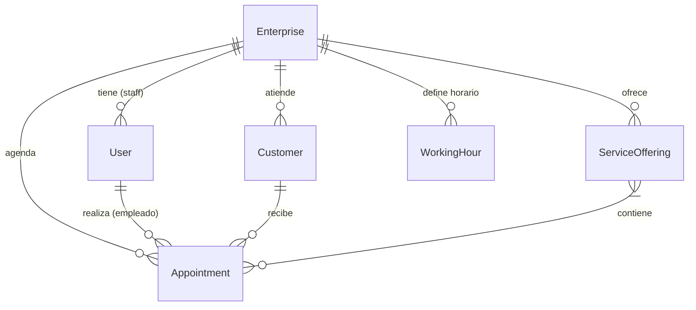

# 🗄 Base de Datos y Modelado

## Repositorio Principal

El sistema utiliza **PostgreSQL 15** como base de datos relacional. Aprovecha su capacidad para tipos JSONB en caso necesario, aunque la mayoría de los datos están estructurados.

## 📊 Entidades y Relaciones

El modelado sigue una estrategia de **Multi-tenancy** donde la entidad `Enterprise` actúa como el discriminador principal.

### Tabla `enterprises` (Tenant)

El contenedor de datos para cada salón.

- `id` (PK): Identificador único.
- `name`: Nombre comercial.
- `slug`: Identificador único en URL (e.g. `peluqueria-pepe`).
- `owner_id`: FK a User (dueño).

### Tabla `app_users` (Usuarios del Sistema)

Empleados y Administradores que acceden al panel de control.

- `id` (PK).
- `enterprise_id` (FK): A qué empresa pertenece.
- `email`: Credencial de acceso.
- `role`: (`ADMIN`, `EMPLOYEE`).

### Tabla `customers` (Clientes Finales)

Base de datos de personas que reciben servicios.

- `id` (PK).
- `enterprise_id` (FK): Un mismo cliente puede estar en múltiples salones (como registros separados).
- `phone`: Teléfono de contacto.
- `email`: Correo (opcional).

### Tabla `appointments` (Citas)

El núcleo transaccional.

- `id` (PK).
- `customer_id` (FK): Quién recibe el servicio.
- `employee_id` (FK): Quién lo realiza (User).
- `service_id` (FK): Qué se realiza.
- `start_time`: Timestamp inicio.
- `end_time`: Timestamp fin.
- `status`: (`PENDING`, `CONFIRMED`, `COMPLETED`, `CANCELLED`).

### Tabla `service_offerings` (Catálogo)

- `id` (PK).
- `name`: Nombre del servicio.
- `duration_minutes`: Duración estándar (30, 60, etc).
- `price`: Precio base.

### Tabla `working_hours` (Horarios)

Define la disponibilidad de cada empleado o del salón en general.

- `day_of_week`: (MONDAY, TUESDAY...).
- `start_time`: 09:00.
- `end_time`: 18:00.
- `employee_id` (FK, nullable): Si es null, aplica a todo el salón.

> [Siguiente: Infraestructura](./07-infraestructura.md)
