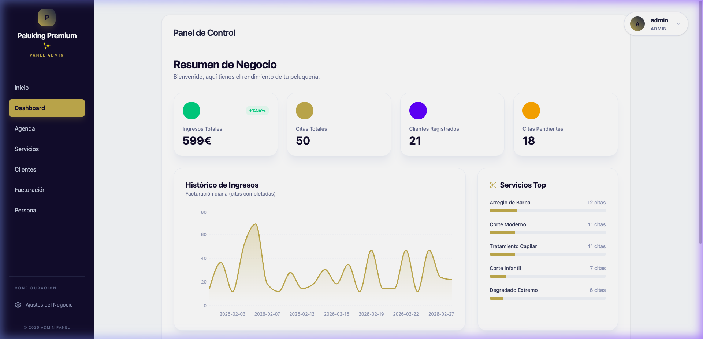
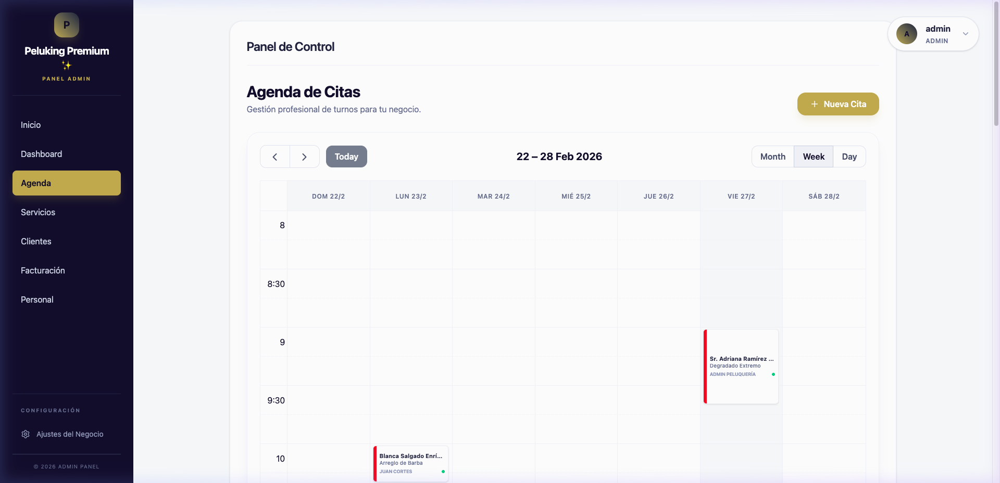
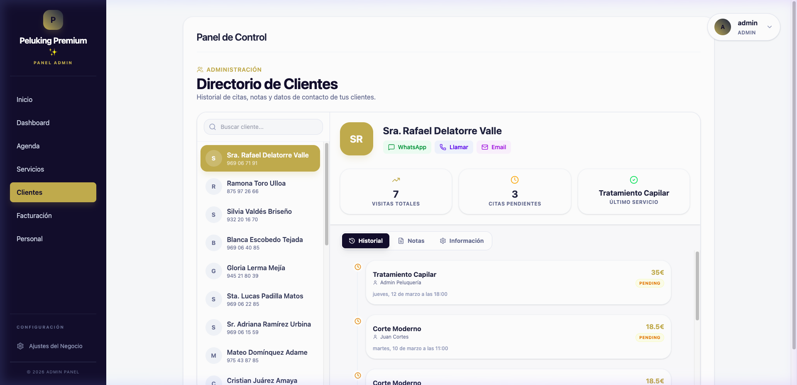
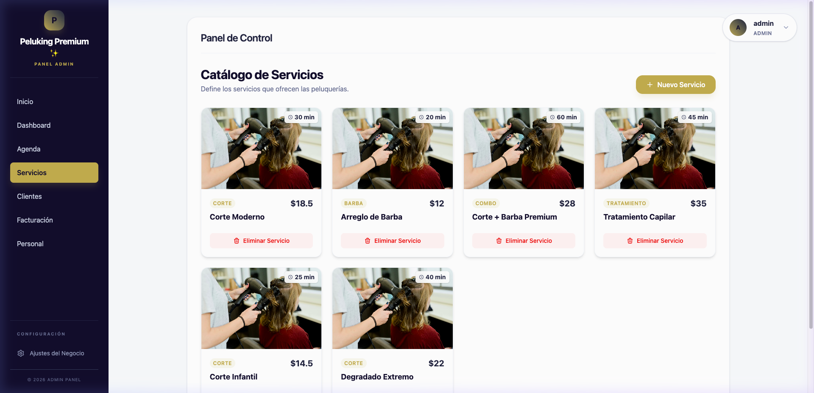
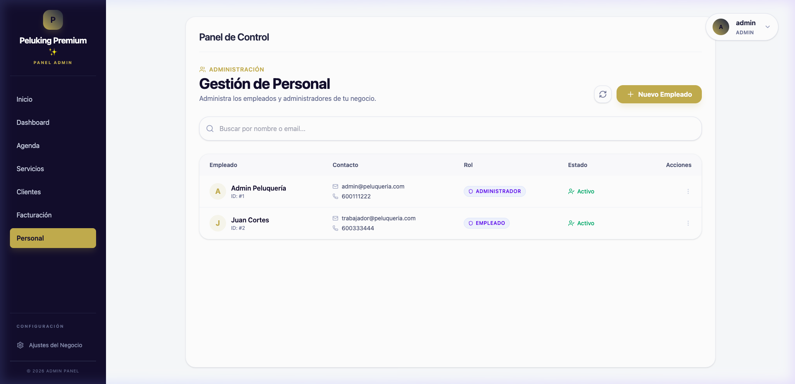
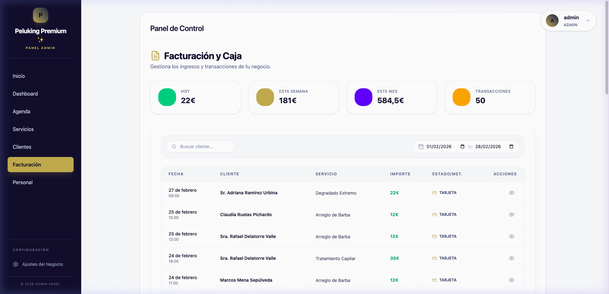
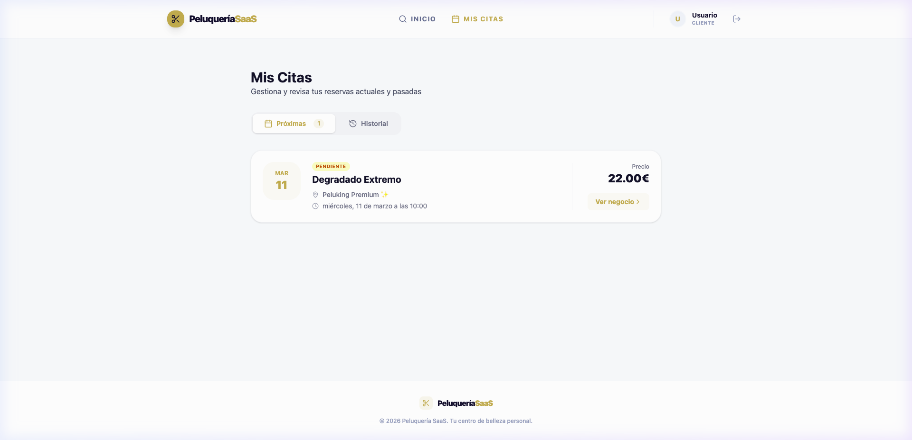

# 📸 Galería de Funcionalidades - Peluquería SaaS

Este documento muestra las principales pantallas y funcionalidades de la plataforma **Peluquería SaaS**, divididas por los roles de usuario: **Público (Marketplace)**, **Administrador de Negocio** y **Cliente Final**.

---

## 🌍 Portal Público & Marketplace

### 1. Página de Inicio (Marketplace)

El punto de entrada para los clientes. Permite descubrir peluquerías destacadas y navegar por categorías.

### 2. Búsqueda de Negocios

Sistema de filtrado por ciudad y servicios para encontrar el salón ideal.

### 3. Perfil Público del Negocio

Página de aterrizaje personalizada para cada peluquería, mostrando sus servicios, precios y valoraciones.

---

## 💼 Panel de Gestión (Admin & Empleados)

### 4. Dashboard de Análisis

Visión general del rendimiento del negocio: ingresos totales, citas completadas, nuevos clientes y servicios más populares.

### 5. Agenda Interactiva (Calendario)

Gestión completa de las citas del día. Permite ver la disponibilidad de los empleados y organizar el flujo de trabajo.

### 6. CRM de Clientes

Listado detallado de clientes con su historial de visitas, notas internas y datos de contacto.

### 7. Gestión de Servicios

Configuración del catálogo: nombres, categorías, precios y duraciones para cada servicio ofrecido.

### 8. Equipo de Profesionales

Gestión de empleados, sus roles y permisos dentro de la plataforma.

### 9. Facturación e Ingresos

Registro de pagos y estado financiero del salón.

---

## 👤 Experiencia del Cliente

### 10. Historial de Citas

Espacio privado para que los clientes consulten sus próximas reservas y su historial de visitas pasadas.

---
